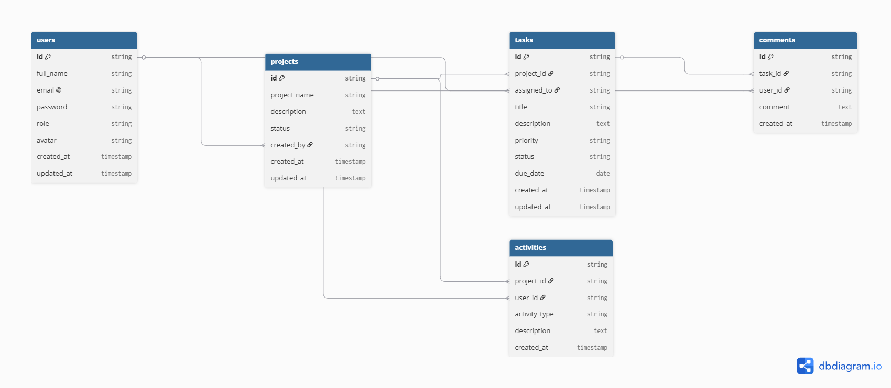

# TaskMatrix

## Smart Agile Project Management Platform

TaskMatrix is a full-stack web application designed to simplify project management for software development teams. It provides a centralized workspace where users can create projects, assign tasks, monitor progress, and collaborate efficiently throughout the software development lifecycle.

The application follows Agile project management principles and is intended to improve productivity by bringing project planning, task tracking, and team collaboration into a single platform. This project is being developed as an individual Capstone submission for the ProDesk Engineering Program across Sprints 13–17.

---

# Project Overview

| Item                   | Description                     |
| ---------------------- | ------------------------------- |
| **Project Name**       | TaskMatrix                      |
| **Development Track**  | Full Stack Development          |
| **Application Type**   | Agile Project Management System |
| **Developer**          | Lanka Lakshmi Pavani            |
| **Development Period** | Sprint 13 – Sprint 17           |

---

# Project Background

Managing software projects across multiple applications often leads to scattered information, communication gaps, and reduced productivity. Teams may use separate tools for project planning, task tracking, and collaboration, making it difficult to maintain a clear overview of ongoing work.

TaskMatrix addresses this challenge by providing a unified platform where projects, tasks, deadlines, and team collaboration can be managed from a single dashboard. The application is designed to be scalable, user-friendly, and suitable for modern software development teams.

---

# Project Goals

* Develop a scalable full-stack web application using modern technologies.
* Simplify project and task management through a centralized platform.
* Support collaboration using role-based access control.
* Track project progress with an intuitive Kanban workflow.
* Build a responsive and user-friendly interface.
* Apply secure authentication and backend development best practices.

---

# Technology Stack

The project will be developed using the following technology stack to ensure a scalable, secure, and maintainable application.

| Category                      | Technologies                                        | Purpose                                                            |
| ----------------------------- | --------------------------------------------------- | ------------------------------------------------------------------ |
| **Frontend**                  | React (Vite), React Router DOM, Tailwind CSS, Axios | Build a fast, responsive, and component-based user interface.      |
| **Backend**                   | Node.js, Express.js                                 | Develop RESTful APIs and handle server-side business logic.        |
| **Database**                  | MongoDB, Mongoose                                   | Store and manage application data using a flexible NoSQL database. |
| **Authentication & Security** | JWT, bcryptjs                                       | Secure user authentication and protect sensitive information.      |
| **Version Control**           | Git, GitHub                                         | Track code changes and manage collaborative development.           |
| **Deployment**                | Vercel, Render                                      | Host the frontend and backend applications for production.         |
| **Design & Planning**         | Figma, Draw.io, dbdiagram.io                        | Design user interfaces and plan the application's architecture.    |

---

# Core Features

The initial version of TaskMatrix focuses on the essential functionality required for effective project management and team collaboration.

## User Authentication

* User Registration
* Secure Login
* JWT Authentication
* Password Encryption
* User Profile Management

## Dashboard

* Project Overview
* Assigned Tasks Summary
* Recent Activity Feed
* Upcoming Deadlines

## Project Management

* Create Projects
* View Project Details
* Edit Project Information
* Delete Projects
* Manage Team Members

## Task Management

* Create Tasks
* Assign Tasks to Team Members
* Edit Task Details
* Delete Tasks
* Set Priority Levels
* Manage Due Dates
* Update Task Status

## Kanban Board

* To Do
* In Progress
* Review
* Completed

## Team Collaboration

* Task Comments
* Activity Timeline
* Role-Based Access Control

## User Profile

* Update Personal Information
* Change Password
* Profile Picture Support

## Future Enhancements

* AI-assisted Task Suggestions
* Real-time Notifications
* Email Notifications
* Calendar Integration
* File Attachments
* Analytics Dashboard
* Time Tracking
* Dark Mode

---

# Development Roadmap

## Sprint 13 – Planning & Architecture

Complete project planning by preparing the Product Requirements Document (PRD), designing UI/UX wireframes, creating the database architecture, and setting up the project repository.

## Sprint 14 – MVP Development

Develop the core application by implementing user authentication, the dashboard, and project management functionality.

## Sprint 15 – Core Feature Development

Build task management, complete CRUD operations, implement the Kanban board, and add team collaboration features.

## Sprint 16 – Enhancement & Optimization

Improve the application by integrating AI-assisted features, enhancing the user experience, and optimizing overall performance.

## Sprint 17 – Testing & Deployment

Perform application testing, fix remaining issues, deploy the project, finalize documentation, and prepare the Capstone demonstration.

---

# UI/UX Design

The user interface will be designed in Figma before implementation begins to establish the application's layout, navigation flow, and responsive design.

**Figma Link**

[View TaskMatrix Figma Wireframes](https://www.figma.com/design/duYYYC44hLe8g8fxEoCKyF/TaskMatrix---UI-Wireframes?node-id=0-1&t=omx7pGYZvPgpeuP8-1)

---

# Database Architecture

The database structure will be planned using an Entity Relationship Diagram (ERD). The initial database design will include the following collections:

* Users
* Projects
* Tasks
* Comments
* Activities

**ER Diagram**

The following Entity Relationship Diagram illustrates the database structure planned for TaskMatrix.

---

# Future Scope

TaskMatrix is planned as a scalable application. After the MVP is completed, future versions may include AI-powered task recommendations, real-time collaboration, advanced reporting, calendar integration, and additional productivity features.

---

## Developer

**Lanka Lakshmi Pavani**

Full Stack Developer

Capstone Project – ProDesk Engineering Program
